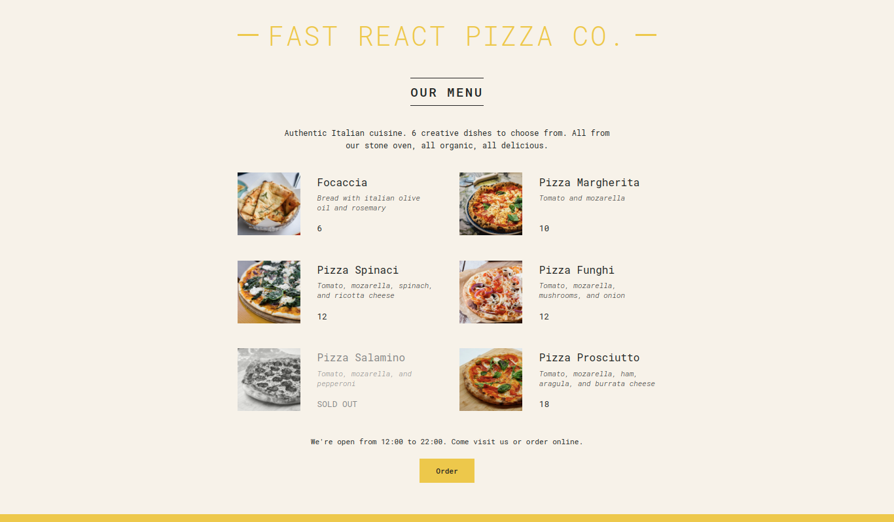
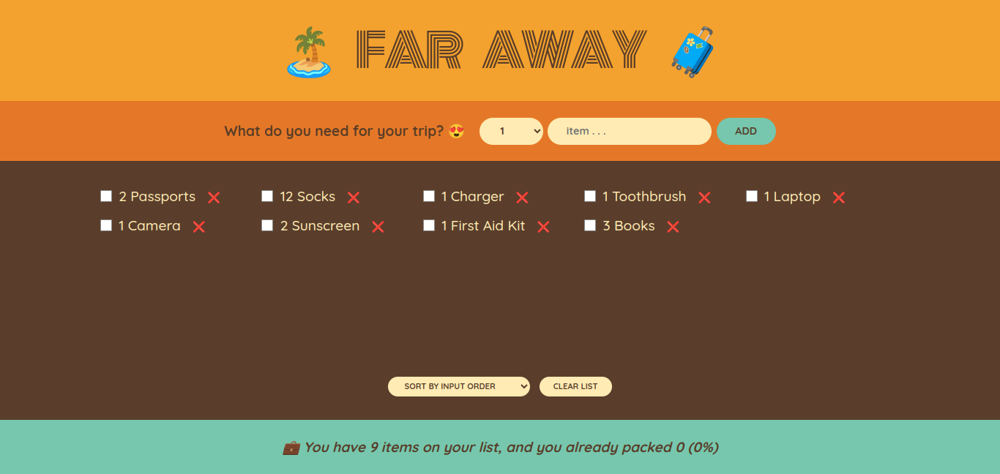
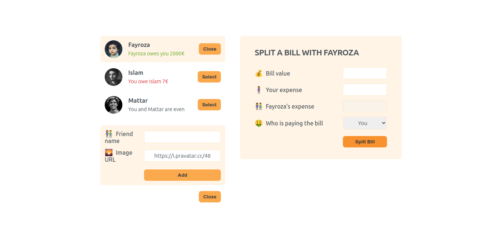
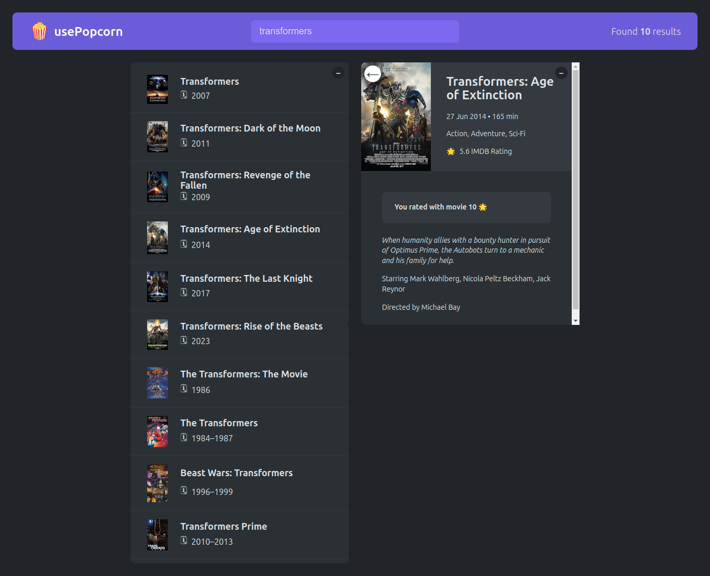
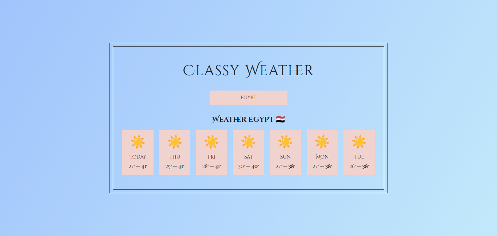
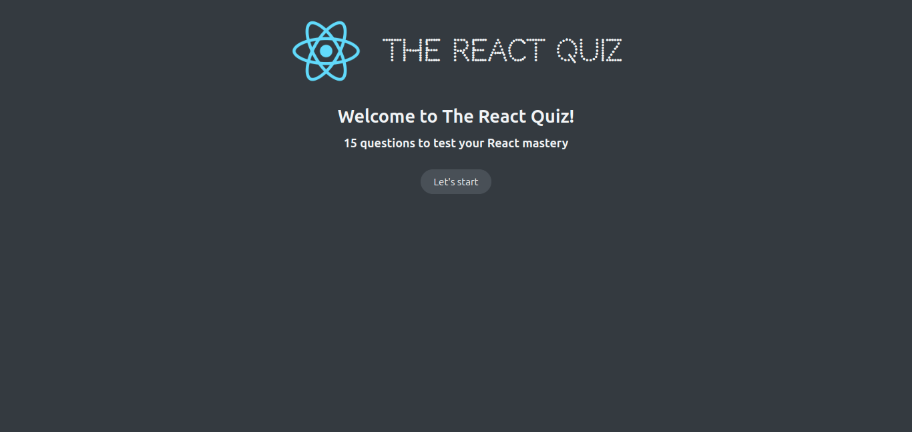
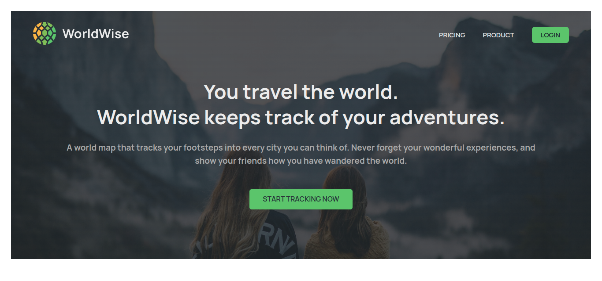
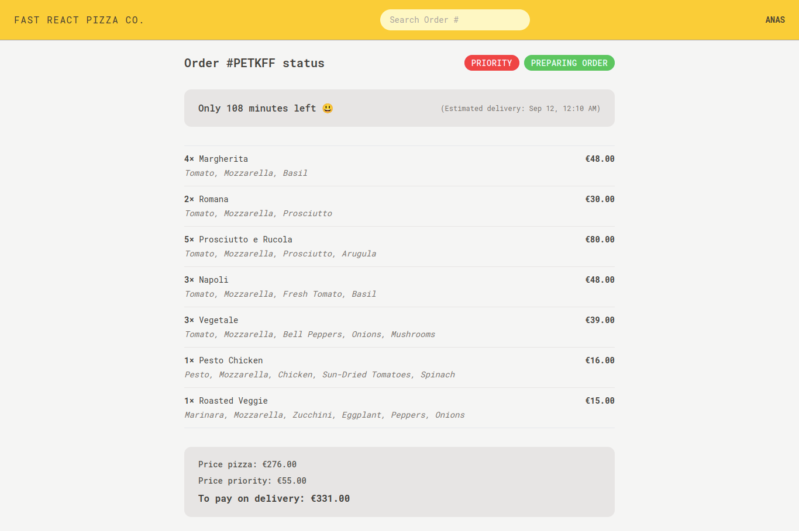
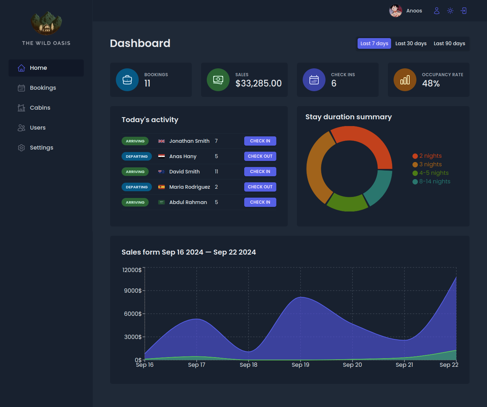

# The Ultimate React Course 2024 🚀🌟

Welcome to **The Ultimate React Course 2024** repository! This repository contains all the projects I built while learning React through [this Udemy course](https://www.udemy.com/course/the-ultimate-react-course/).

## Projects Overview 📁

Here are some of the amazing projects you'll find in this repository:

1. **00-setup** 🛠️  
   Setting up the environment for a seamless React journey.

2. **01-pure-react** ⚛️  
   Introduction to React basics, including JSX, components, and props.

3. **02-JS-review** 📜  
   A review of essential JavaScript concepts for React development.

4. **03-pizza-menu** 🍕  
   A simple interactive pizza menu app showcasing component-based design.

   
   ➡️ Check out the live demo [here](https://pizza-menu-2193.netlify.app/)! 🚀

5. **04-steps** 🚶  
   A step tracker app to count and display daily steps.

6. **05-travel-list** 🌍  
   Travel packing list app to manage items for trips.

   
   ➡️ Check out the live demo [here](https://travel-list-2193.netlify.app/)! 🚀

7. **06-eat-n-split** 🍽️  
    Splitting restaurant bills easily with friends.

   
   ➡️ Check out the live demo [here](https://eat-n-split-2193.netlify.app/)! 🚀

8. **07-usepopcorn** 🍿  
   Manage your favorite movies and popcorn binge sessions.

   
   ➡️ Check out the live demo [here](https://usepopcorn-2193.netlify.app/)! 🚀

9. **08-how-react-works** 🧠  
   Deep dive into React's internals, hooks, and state management.

10. **09-classy-weather** 🌦️  
     A weather app with class-based components.

    
    ➡️ Check out the live demo [here](https://classy-weather-2193.netlify.app/)! 🚀

11. **10-react-quiz** 📝  
    A quiz app built with React to test your knowledge.

    
    ➡️ Check out the live demo [here](https://the-react-quiz-2193.netlify.app/)! 🚀

12. **11-worldwise** 🌎  
     World geography app that fetches country data and statistics.

    
    ➡️ Check out the live demo [here](https://world-wise-2193.netlify.app/)! 🚀

13. **12-atomic-blog** 📝  
    A blogging platform built using atomic design principles.

14. **13-workout-timer** ⏱️  
    A timer app for workouts and training sessions.

15. **14-redux-intro** 🔄  
    Intro to Redux for managing global application state.

16. **15-fast-react-pizza** 🍕🔥  
    Fast-paced pizza app with Redux integration.

    
    ➡️ Check out the live demo [here](https://fast-react-pizza-2193.netlify.app/)! 🚀

17. **16-the-wild-oasis** 🏕️  
    Camping and adventure trip planner built with React.

    
    ➡️ Check out the live demo [here](https://the-wild-oasis-2193.netlify.app/)! 🚀

## How to Use 🖥️

1. Clone the repo:  
   `git clone https://github.com/AnasHany219/The_Ultimate_React_Course_2024.git`

2. Navigate to any project folder:  
   `cd 03-pizza-menu`

3. Install dependencies:  
   `npm install`

4. Run the project:  
   `npm start` | `npm run dev`

## 🛠️ Technologies Covered

- **React Fundamentals**: `Components`, `JSX`, `props`, `events`, `forms`
- **State Management**: `useState`, `useReducer`, `Context API`, `Redux`, `Toolkit`
- **Advanced React**: `React Query`, `Tailwind CSS`, `custom hooks`, `authentication`, `dark mode`, and more
- **Performance Optimization**: `Memoization`, `code splitting`, `lazy loading`

## 🎓 Course Information

- Duration: **67 hours**
- Lectures: **405**
- Instructor: [Jonas Schmedtmann](https://www.udemy.com/course/the-ultimate-react-course/)
- 🌐 [Join the course here](https://www.udemy.com/course/the-ultimate-react-course/)
